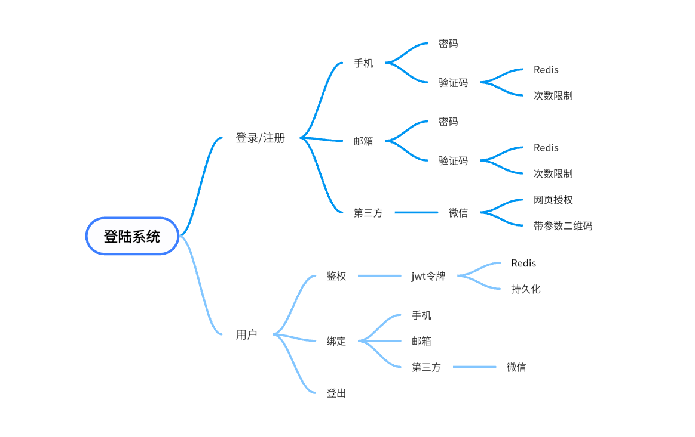
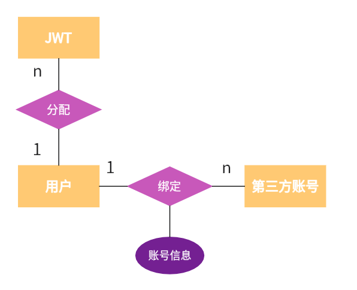

# 登录系统
## 需求分析

## 数据库设计
### ER图

### 关系模型

- **用户**（id（*pk*），用户名，昵称，手机号，邮箱，密码）
- **第三方账号**（id（*pk*），用户id（*fk*），平台名，账号信息）
- **JWT** (id（*pk*），用户id（*fk*），失效时间，是否注销)

## 接口设计
- https://apifox.com/apidoc/shared-95fb4b1e-ab46-497a-a41d-d250c1ae19ed

